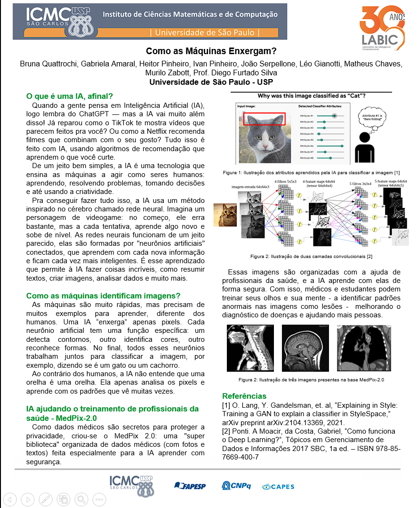

# 🧠 SCC0270 - Redes Neurais

Repositório com os projetos da disciplina **SCC0270 - Redes Neurais e Aprendizado Profundo**, oferecida pelo ICMC - USP São Carlos, 2025.

## 🔧 Configuração do Ambiente

Este projeto utiliza o gerenciador de ambientes e dependências [`uv`](https://github.com/astral-sh/uv).  
Para configurar o ambiente corretamente, siga os passos abaixo:

### 1. Instale o `uv`

Se ainda não tiver o `uv` instalado, execute:

```bash
curl -Ls https://astral.sh/uv/install.sh | bash
```

### 2. Crie e sincronize o ambiente virtual

Para criar um ambiente virtual e instalar todas as dependências listadas no `pyproject.toml`, execute:

```bash
uv sync
```

Este comando cria automaticamente o ambiente virtual e instala as bibliotecas necessárias.

---

## 📂 Organização do Repositório

- `data/` — 📦 Dados utilizados nos projetos  
- `notebooks/` — 📒 Notebooks de desenvolvimento e análise  
- `model/` - 🔧 Modelos ResNet50
- `posters/` — 🖼️ Material gráfico (pôsteres e apresentações)  
- `assets/` — 📁 Arquivos auxiliares como imagens usadas no README  

---

# Projetos

Os projetos são baseados no seguinte paper ["MedPix 2.0: A Comprehensive Multimodal Biomedical Dataset for Advanced AI Applications"](https://arxiv.org/html/2407.02994v1#S3)

O objetivo dos autores foi construir um conjunto de dados melhor estruturado com imagens médicas e informações clínicas associadas a cada imagem a fim de disponibilizar uma fonte de dados para que pesquisadores e profissionais da saúde possam, a partir desses dados, construir soluções de IA para a área médica uma vez que um conjunto de dados padronizado está disponível.

A principal motivação dos autores deve-se ao fato de que a maioria dos dados médicos são privados e, até a publicação do trabalho, inexistiam conjuntos de dados médicos abertos cuja estrutura permitisse o desenvolvimento de soluções baseadas em IA.

## Dados (MedPix 2.0)

Este projeto utiliza o conjunto de dados **MedPix 2.0**, uma base de dados biomédica multimodal abrangente e de alta qualidade, desenvolvida para aplicações avançadas de Inteligência Artificial (IA) no domínio médico. Originária da conhecida base de dados MedPix® (utilizada para Educação Médica Continuada), a MedPix 2.0 foi criada para superar a escassez de datasets médicos de alta qualidade e de acesso público, especialmente para o desenvolvimento de Modelos de Linguagem de Grande Porte Multimodais (MLLM).

A construção do MedPix 2.0 envolveu um **pipeline semi-automático para a extração de dados visuais e textuais**, seguido por um **processo de curadoria manual** para remover amostras ruidosas. Os dados são armazenados em uma **base de dados não-relacional MongoDB**, que reorganiza a estrutura do MedPix® original, tornando-a mais acessível e estruturada para aplicações de IA.

### Estrutura dos Dados

A MedPix 2.0 integra **dados visuais (scans de Tomografia Computadorizada - TC e Ressonância Magnética - RM)** e **dados textuais (relatórios clínicos e achados)**. Cada caso clínico dentro do dataset contém ao menos uma imagem médica e as informações correspondentes, como achados, notas de discussão, diagnóstico, diagnóstico diferencial, tratamento e acompanhamento, todas apresentadas em um formato semi-estruturado JSON.

Na implementação do MongoDB, os dados são organizados em duas coleções principais:

- **`Image_Descriptions`**: Contém **documentos de descrição (`descriptions documents`)**, que armazenam informações estritamente conectadas às imagens. Estes documentos incluem detalhes como a modalidade do exame (CT ou MR) e a parte do corpo (Location).
- **`Clinical_reports`**: Contém **documentos de caso-tópico (`case-topic documents`)**, que agrupam informações detalhadas de um caso clínico completo, incluindo explicações acadêmicas e gerais sobre a doença investigada.

Existe uma relação de um-para-muitos entre os casos clínicos e as imagens, onde o identificador único (`U_id`) de um documento de caso-tópico é incorporado em cada documento de descrição de imagem a ele relacionado. As imagens em si são armazenadas na pasta `MedPix-2.0/images/` e acessadas via URL.

### Divisão e Acesso aos Dados no Projeto

Para este projeto, um subconjunto dos dados da MedPix 2.0 foi dividido em **conjuntos de treinamento e teste** e estão presentes na pasta `MedPix-2.0/splitted_dataset/`. Os dados são fornecidos em arquivos JSON, que seguem a estrutura dos documentos descritos acima. Exemplos desses arquivos incluem:

- **`descriptions_train.jsonl`**: Documentos de descrição para o conjunto de treinamento.
- **`data_train.jsonl`**: Documentos de caso-tópico para o conjunto de treinamento.
- **`descriptions_test.jsonl`**: Documentos de descrição para o conjunto de teste.
- **`data_test.jsonl`**: Documentos de caso-tópico para o conjunto de teste.

Essa estruturação de dados facilita o uso direto para o treinamento e fine-tuning de modelos de Machine Learning e Deep Learning, sem a necessidade de pré-processamento adicional para tarefas multimodais. A base de dados MedPix 2.0, com sua curadoria e estruturação, é um ponto de partida relevante para o desenvolvimento de sistemas de IA multimodal no domínio médico, incluindo sistemas de extração de informação, análise automatizada de imagens e modelos de IA generativa para relatórios clínicos.

O código-fonte do projeto e os dados utilizados para teste e treinamento estão **disponíveis gratuitamente** nos repositórios públicos indicados no artigo original.

## 🚀 Projeto 01

📅 **Prazo:** 21/06/2025  

**Tarefas:**  

- 🔍 Classificador binário de **Modalidade** (`CT` ou `MR`)  
- 🧠 Classificador multi-classe de **Localidade** (21 classes)  

O objetivo do Projeto 01 é construir um classificador binário capaz de classificar as imagens como `CT` (Tomografia Computadorizada) ou `MR` (Ressonância Magnética) e também um classificador multi-classe para classificar as Localidades associadas a cada imagem. São 21 Localidades disponíveis: `Chest, Pulmonary`, `Genitourinary`, `Head and Neck`, `Cardiovascular`, `Brain and Neuro`, `Abdomen`, `Spine`, `Eye and Orbit`, `Gastrointestinal`, `Vascular`, `Endocrine`, `Musculoskeletal`, `Pathology`, `Generalized`, `Hematopoietic`, `Dental, Oral, or Tooth`, `Nerve, central`, `Breast and Mammography`, `Bethesda, MD`, `Ophthalmology`, `Nerve, peripheral`.

De início, no notebook `Trabalho_01_ML.ipynb` foram construídos modelos de ML clássicos baseados em técnicas de extração de características como Descritores de Texturas e Cores e em seguida, ajustou-se um KNN.
No notebook presente no Colab no seguinte [Notebook com treino da CNN para Modalidade no Colab](https://drive.google.com/drive/folders/1nnpJwP1hIiqQjFYWDabOCFGvpeqj7dPg?usp=drive_link) fez-se o fine-tuning de uma ResNet50 para a classificação da modalidade e no notebook [Notebook com treino da CNN para Localidade no Colab](https://colab.research.google.com/drive/1X9ANeqFUI9rEleWq8OYalE2q5EnB3cQ_?usp=drive_link) fez-se o fine-tuning de uma ResNet50 para a classificação da localidade.

O código para carregamento do modelo treinado e cálculo das métricas de avaliação estão presentes no notebook `Trabalho_01_CNN.ipynb`.

Obtivemos os seguintes resultados na tarefa de classificação binária:

## Resultados Classificação da Modalidade

### KNN + Descritores de Textura

| Class        | Precision | Recall | F1-Score | Support |
|--------------|-----------|--------|----------|---------|
| MR           | 0.00      | 0.00   | 0.00     | 100     |
| CT           | 0.50      | 1.00   | 0.67     | 100     |
| **Accuracy** |           |        | 0.50     | 200     |
| **Macro Avg**| 0.25      | 0.50   | 0.33     | 200     |
| **Weighted Avg** | 0.25  | 0.50   | 0.33     | 200     |

### KNN + Descritores de Imagem

| Class          | Precision | Recall | F1-Score | Support |
|----------------|-----------|--------|----------|---------|
| MR             | 0.60      | 0.64   | 0.62     | 100     |
| CT             | 0.62      | 0.58   | 0.60     | 100     |
| **Accuracy**   |           |        | 0.61     | 200     |
| **Macro Avg**  | 0.61      | 0.61   | 0.61     | 200     |
| **Weighted Avg**| 0.61     | 0.61   | 0.61     | 200     |

### KNN + Descritores de Textura + Imagem

| Class           | Precision | Recall | F1-Score | Support |
|-----------------|-----------|--------|----------|---------|
| MR               | 0.00      | 0.00   | 0.00     | 100     |
| CT               | 0.50      | 1.00   | 0.67     | 100     |
| **Accuracy**     |           |        | 0.50     | 200     |
| **Macro Avg**    | 0.25      | 0.50   | 0.33     | 200     |
| **Weighted Avg** | 0.25      | 0.50   | 0.33     | 200     |

### Fine-tuning ResNet50 (02 epochs)

| Class           | Precision | Recall | F1-Score | Support |
|-----------------|-----------|--------|----------|---------|
| MR               | 0.99      | 0.98   | 0.98     | 100     |
| CT               | 0.98      | 0.99   | 0.99     | 100     |
| **Accuracy**     |           |        | 0.98     | 200     |
| **Macro Avg**    | 0.99      | 0.98   | 0.98     | 200     |
| **Weighted Avg** | 0.99      | 0.98   | 0.98     | 200     |

## Resultados Classificação da Localidade (ResNet50 - 02 Epochs)

Métodos de ML com descritores de textura e cores não foram capazes de classificar a Localidade das imagens.
Foi treinado, do mesmo modo, uma ResNet50 para a classificação das 21 localidades.

| Label                  | Precision | Recall | F1-Score | Support |
|------------------------|-----------|--------|----------|---------|
| Chest, Pulmonary       | 0.00      | 0.00   | 0.00     | 1       |
| Genitourinary          | 0.68      | 0.94   | 0.79     | 51      |
| Head and Neck          | 0.00      | 0.00   | 0.00     | 4       |
| Cardiovascular         | 0.00      | 0.00   | 0.00     | 1       |
| Brain and Neuro        | 0.70      | 0.88   | 0.78     | 24      |
| Eye and Orbit          | 1.00      | 0.29   | 0.44     | 7       |
| Gastrointestinal       | 0.75      | 0.29   | 0.42     | 31      |
| Vascular               | 0.00      | 0.00   | 0.00     | 10      |
| Pathology              | 0.18      | 0.27   | 0.21     | 11      |
| Spine                  | 0.43      | 0.30   | 0.35     | 10      |
| Endocrine              | 0.48      | 0.71   | 0.57     | 14      |
| Nerve, central         | 0.00      | 0.00   | 0.00     | 4       |
| Musculoskeletal        | 0.82      | 0.69   | 0.75     | 26      |
| Abdomen                | 0.00      | 0.00   | 0.00     | 6       |
| **Accuracy**           |           |        | **0.57** | 200     |
| **Macro Avg**          | 0.36      | 0.31   | 0.31     | 200     |
| **Weighted Avg**       | 0.58      | 0.57   | 0.54     | 200     |

Obtivemos uma **acurácia de 57%** que é ligeiramente superior à reportada pelos autores de 52.5%.  
Como nem todas as classes estão presentes no conjunto de teste, a tabela acima não apresenta todas as classes.
Percebe-se que as Localidades com menos exemplos disponíveis no conjunto de treinamento apresentam menores valores de acurácia, o que é o esperado.
Não observamos melhoras significativas com o aumento do número de epochs acima de 2.

---

## 🚧 Projeto 02

🗓️ **Prazo:** 09/07/2025\
🔄 **Classificador Multimodal com CLIP**

O objetivo do Projeto 02 foi desenvolver um classificador de **Localidade Anatômica** utilizando uma abordagem **multimodal**, combinando informações visuais (imagem médica) e textuais (legenda associada) por meio do modelo **CLIP (Contrastive Language-Image Pretraining)** da OpenAI.

Inicialmente, um dataset customizado foi criado a partir dos arquivos JSON da MedPix 2.0, contendo a associação entre imagem, legenda (`Caption`) e localização anatômica (`Location`). Os dados foram processados e divididos em conjuntos de treino e teste, com as imagens sendo carregadas e processadas juntamente com os textos utilizando o `CLIPProcessor`.

O modelo foi construído em duas etapas:

- Extração dos **embeddings** de imagem e texto via modelo pré-treinado `clip-vit-base-patch32`;
- Treinamento de um **classificador simples** com camadas lineares sobre a concatenação dos embeddings.

---

### 📈 Curvas de Treinamento

Durante as 30 épocas, observou-se uma **queda consistente nas perdas de treino e validação**, sem sinais de overfitting.

| Época | Loss Treino | Loss Validação |
| ----- | ----------- | -------------- |
| 1     | 2.7800      | 2.4204         |
| 10    | 1.3309      | 1.3012         |
| 20    | 1.0183      | 1.0025         |
| 30    | 0.8183      | 0.8064         |

> 🔍 A diferença entre as curvas foi pequena durante todo o treinamento, indicando boa generalização. Mesmo após 30 épocas, ambas ainda apresentam tendência de queda.

---

### 📋 Resultados por Classe (classification\_report)

O modelo alcançou uma **acurácia total de 78%**, superando a baseline de 52.5% reportada no artigo original. Abaixo estão os principais resultados por classe:

```markdown
| Classe                    | Precision | Recall | F1-Score | Suporte |
|---------------------------|-----------|--------|----------|---------|
| Brain and Neuro           | 0.80      | 0.97   | 0.88     | 522     |
| Musculoskeletal           | 0.85      | 0.95   | 0.89     | 209     |
| Chest, Pulmonary          | 0.79      | 0.95   | 0.86     | 187     |
| Gastrointestinal          | 0.65      | 0.95   | 0.77     | 154     |
| Genitourinary             | 0.71      | 0.83   | 0.77     | 120     |
| Cardiovascular            | 0.89      | 0.66   | 0.76     | 50      |
| Spine                     | 0.78      | 0.65   | 0.70     | 48      |
| Eye and Orbit             | 0.88      | 0.57   | 0.69     | 49      |
| Head and Neck             | 0.77      | 0.58   | 0.66     | 76      |
| Generalized               | 1.00      | 0.11   | 0.19     | 56      |
| Abdomen                   | 1.00      | 0.10   | 0.17     | 42      |
| Vascular                  | 0.82      | 0.27   | 0.41     | 66      |
| Classes com suporte < 10  | 0.00      | 0.00   | 0.00     | -       |

|                           |           |        |          |         |
| **Acurácia total**        |           |        | **0.78** | 1653    |
| **Média Macro**           | 0.47      | 0.36   | 0.37     |         |
| **Média Ponderada**       | 0.76      | 0.78   | 0.74     |         |
```

> 📌 **Análise:**
>
> - O modelo se saiu muito bem em classes com maior volume de dados (e.g., `Brain and Neuro`, `Musculoskeletal`).
> - Classes com poucos exemplos tiveram desempenho muito baixo ou nulo, como esperado.
> - A **média ponderada** mostra que, mesmo com desbalanceamento, o modelo foi eficaz na tarefa geral de classificação multimodal.

---

## 🎯 Projeto 03

📅 **Prazo:** 11/06/2025  

Atividade Extensionista no campus da USP - São Carlos (ICMC) com apresentação do pôster:  
🖼️ **"Como as máquinas enxergam?"**  

**Arquivo:** `posters/Poster Rede Neurais - Final.pptx`  

**Imagem do Pôster**  
  

---

## 👥 Integrantes

- Brunna Quatrochi [🔗 LinkedIn](https://www.linkedin.com/in/brunna-quatrochi/)
- Gabriela dos Santos Amaral 🐙 [GitHub](https://github.com/GabrielaSAmaral) | [🔗 LinkedIn](https://www.linkedin.com/in/gabriela-amaral-ga/)
- Heitor Carvalho Pinheiro 🐙 [GitHub](https://github.com/Heitorcp) | [🔗 LinkedIn](https://www.linkedin.com/in/heitor-cp/)
- Ivan Barbosa Pinto 🐙 [GitHub](https://github.com/ivpinheiro) | [🔗 LinkedIn](https://www.linkedin.com/in/ivanpinheiro/)
- João Pedro Serpellone
- Leo Gianotti [🔗 LinkedIn](https://www.linkedin.com/in/leo-gianotti-48124a20a/)
- Matheus Chaves Silva [🔗 LinkedIn](https://www.linkedin.com/in/matheus-chaves-silva-86425913a/)
- Murilo Valentim Zabott
